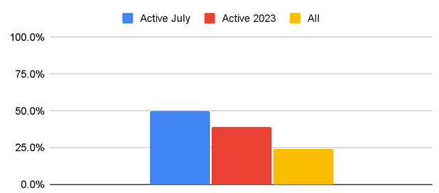
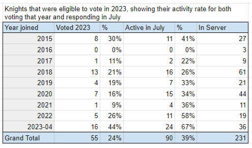

# Election Movement Act
This bill proposes moving the April Knights Grandmaster election to late January. The law document executing this change can be found here. The purpose of this document is to highlight the reasons why such a move would be beneficial for the Knights. If this bill passes, the law linked will be put into effect.

### Section I - Overview of reasons

1. Healthier for the candidates
    1. It is easier for a candidate to commit to an event 4 months later than one 12 months later. We would have more people willing to run for Grandmaster, and those who are running could speak confidently to their availability.
    1. It is less likely that the Grandmaster would have to step down due to unforeseen circumstances happening in that year. The Line of Succession law handles this, but has not been updated to reflect the most recent Upper Council changes.
    1. All officers would be chosen fresh for the upcoming event. While this can be accomplished currently by the Grandmaster updating their UC, it feels like firing someone after Christmas instead of a fresh start.
1. Healthier for the election
    1. If we choose to host the election in January, we do not have to rush the process like we currently do. The new law implements many beneficial changes that would actually increase our voter turnout, such as a longer voting window and notifications.
    1. Having the election 8 months after the event gives Recruits a better chance to understand how things work and feel more comfortable voting impactfully in their first election. It also gives more Recruits a chance to finish their interview before the election.
    1. We can post the Registration thread immediately after the event. This turns into a “notify me” board, where we capture the attention of all Knights immediately after the event, and then we are able to notify them when the actual election occurs. This allows us to combine the best of both worlds: capturing the activity of the active Knights immediately following the event, but giving us time to grant our elections the honor and due process they deserve.
1. Healthier for the Knights as a whole
    1. Hosting the election in January helps kick off activity for the upcoming season.
    1. If Reddit continues to have a Place event every summer, it would be healthier for the Order to maintain the same Grandmaster for the two events. Grandmaster hand-offs often take up to two months to fully complete.
    1. Not having the election immediately after the event allows time for us to enjoy the aftermath and make memes, historical records, and lore. It gives the Grandmaster the chance to actually rest and enjoy the aftermath of the event with their friends. It also means they can focus on channeling the energy and excitement of the Knights into creating new things while they are inspired.
    1. Our off-season "Great Fizzle" is actually brought on faster by the election. We've been trying to encourage more engagement year-round, but we've actually been hampering ourselves by having the very first thing after the event be politics and leadership change. We have more engagement for both April and July events than we do for elections. **We have been prioritizing politics at the expense of the health of the Knights!** We're asking the question "how can we get the most votes" when we need to be asking "how can we engage all of these new people?" Knights that are active and engaged will choose to vote when they have the opportunity.

### Section II - Evidence
Treating the July event as a benchmark, we can measure how likely our Knights are to at least notice something important happening in the off-season.

[This spreadsheet](https://docs.google.com/spreadsheets/d/1v_FhN9lcz8-3yN95BYIMjbrTK5TGoVjDsFle_OO96ZM/edit?usp=sharing) analyzes all Knights currently in the server, in addition to three Knights who have left but voted in the 2022 election. Select charts are included below.

Both seasonal and non-seasonal Knights are equally likely to respond to an out-of-season “Call To Arms”

Focusing on the Knights that were active in July, only half of them voted. Knights that were active at any time this past year, the interest in voting was even lower.

Our voter rate is lower than our July activity rate, despite being advertised longer. Our voter participation rate is not due to a lack of opportunity. Moving it to a slower time of the year will not suppress votes; it will give us time to focus on the election without suppressing the fun stuff.

### Section III - Revise Constitution
The Constitution will need to be revised to reflect the new election date.

**Article 1, Section 2, point 4**

> The Grandmaster shall serve a term lasting from the moment they are sworn in until the next April event is finished.

Changes to

> The Grandmaster shall serve a term lasting from the moment they are sworn in until the next Grandmaster is sworn in.

This bill will also preserve the **already passed** Constitutional revision detailed in the Election Act v1.0 [here](https://docs.google.com/document/d/1hU9NEfn8lslSeoIgHMRG_Ax32HixKaqKzr4gz6w-wMw/edit).

### Section IV - Revise Election Act
1.  The Election Act will need to be revised to reflect the new election date.
The previous version is [here](https://docs.google.com/document/d/1hU9NEfn8lslSeoIgHMRG_Ax32HixKaqKzr4gz6w-wMw/edit). The new version is [here](https://docs.google.com/document/d/1GspJQGnniI6oT_FuQLkvgNnPxesd0TqTuwih0FDo7Z4/edit), and will replace the previous version.
2.  The major changes are:
    1. Changing the time of the vote
    2. Changing the tie breaker method. Two back-to-back elections is not supportable, and cannot change the fact that half of the Knights will be happy and half will be disappointed. That fact would be unfortunate, but a prompt decision must be made.

### Section V - Enactment
1.  This bill proposes a revision to the Constitution and Election Act simultaneously. If passed, both the revisions go into effect as soon as this bill is passed by both Councils. The revisions may not take effect without each other.
2.  If this bill passes, the next election will occur in April 2024, and will elect a Grandmaster for a 9 month term, lasting until January 2025, at which point another election will occur. The registration thread will be opened at the end of the April event and will be used for both of these elections, and will clearly state this fact. The April 2024 election will be the last mandated election in April, and it will use the time windows specified in the Election Act v1.0.

### Section VI - Reversion
1. 	In 2022 and 2023, there were 58 and 57 Knights who voted, respectively. Given that the primary concern against this bill is that a January election will have less voting participation, this bill has an automatic reversion clause.
2.	If the voting participation in the 2025 January election is less than 54 valid votes, (95% of the previous years) this bill will automatically be reverted. The Constitution will lose the change outlined in this bill, but keep any other changes made between the passing of this bill and the reversion window. The document version number will increase, in order to properly convey the change. The Election Act, being a full rewrite, will return to v1.0.
3.	The Councils may choose to override this reversion. It is possible that obvious and extraneous factors may cause the voting participation to fall below the threshold, and the Council may feel it wise to continue to uphold this bill. Examples include: Reddit declaring an end to April events, being bought by another company, or shutting down entirely.
4.	This reversion will be brought before the Councils no later than one week after the voting period is finished, and only if the voting participation falls below the given threshold. The Councils may vote to override the reversion with a simple majority in both Councils.
